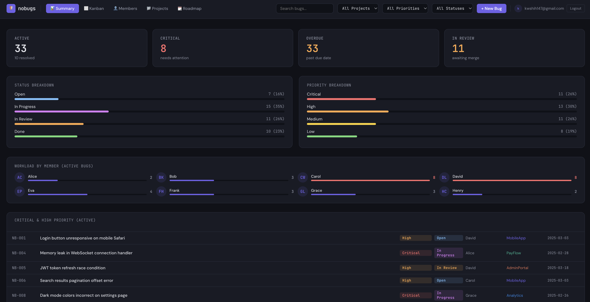
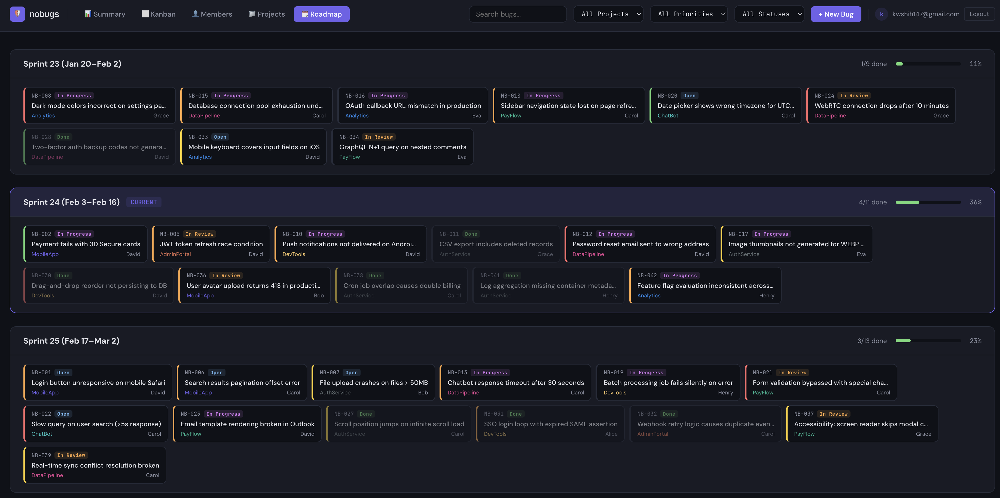

# nobugs

A flexible bug tracker dashboard that uses **Notion as its database**. Your team keeps working in Notion — you get a powerful, multi-view dashboard with authentication.





## Views

| View | Description |
|------|-------------|
| Summary | Stats, breakdowns by status/priority, workload per member, critical bugs |
| Kanban | Drag-style columns: Open → In Progress → In Review → Done |
| Members | Click a member to filter their bugs, see who's overloaded |
| Projects | Per-project cards with resolution %, filter by project |
| Roadmap | Sprint timeline with progress bars and bug cards |

All views support global filters (project, priority, status, search).

## Tech Stack

| Layer | Technology |
|-------|-----------|
| Frontend | React 18, Vite 6, inline styles |
| Backend | Express 4, Notion SDK |
| Auth | Invite code + email, JWT (httpOnly cookie) |
| Runtime | Node.js 20 |
| Deployment | Docker / Docker Compose |

## Architecture

```
┌─────────────────────────────────────────────────┐
│                  Browser                         │
│  ┌─────────────┐  ┌──────────┐  ┌────────────┐ │
│  │ Login Page   │  │ Header   │  │ Views      │ │
│  │ (email+code) │  │ (user,   │  │ (Summary,  │ │
│  │              │  │  logout) │  │  Kanban,   │ │
│  │              │  │          │  │  Members,  │ │
│  │              │  │          │  │  Projects, │ │
│  │              │  │          │  │  Roadmap)  │ │
│  └──────┬───────┘  └────┬─────┘  └─────┬──────┘ │
│         │               │              │         │
│         └───────┬───────┴──────────────┘         │
│                 │ fetch /api/* & /auth/*          │
└─────────────────┼────────────────────────────────┘
                  │
    ┌─────────────▼──────────────┐
    │     Express API Server      │  port 3001
    │  ┌──────────┐ ┌──────────┐ │
    │  │ auth.js   │ │ notion.js│ │
    │  │ (JWT,     │ │ (CRUD,   │ │
    │  │  invite   │ │  prop    │ │
    │  │  code)    │ │  mapper) │ │
    │  └──────────┘ └────┬─────┘ │
    └─────────────────────┼──────┘
                          │ Notion SDK
    ┌─────────────────────▼──────┐
    │     Notion Database         │
    │  (bugs, members, sprints)   │
    └────────────────────────────┘
```

**Data flow:**
```
App.jsx → useBugs() hook → api.js → mock data (default)
                                   → /api/* → Express → Notion (production)
```

Mock mode (`VITE_DATA_SOURCE` unset) uses seeded fake data — no server needed.

## Quick Start (Mock Data)

No Notion setup needed — uses built-in mock data:

```bash
npm install
npm run dev
```

Open http://localhost:3000

## Connect to Notion

### 1. Create a Notion Integration

1. Go to https://www.notion.so/my-integrations
2. Click **"New integration"**
3. Name it "nobugs", select your workspace
4. Copy the **Internal Integration Secret**

### 2. Share Your Database

1. Open your bug tracking database in Notion
2. Click **...** → **Connections** → **Connect to** → select "nobugs"
3. Copy the **database ID** from the URL:
   ```
   https://www.notion.so/{workspace}/{database_id}?v=...
                                      ^^^^^^^^^^^^
   ```

### 3. Configure Environment

```bash
cp .env.example .env
```

Edit `.env`:
```
NOTION_API_KEY=secret_abc123...
NOTION_DATABASE_ID=abc123def456...
DATA_SOURCE=notion
```

### 4. Map Your Properties

Edit `server/notion.js` and update `PROP_MAP` to match your Notion database property names:

```js
const PROP_MAP = {
  title: 'Title',           // Your title property name
  status: 'Status',         // Your status property name
  priority: 'Priority',     // Select: Critical, High, Medium, Low
  assignee: 'Assignee',     // Select or Person type
  project: 'Project',       // Select type
  tags: 'Tags',             // Multi-select type
  sprint: 'Sprint',         // Select type
  due: 'Due Date',          // Date type
  description: 'Description', // Rich text type
};
```

### 5. Run with Notion

```bash
# Terminal 1: API server
npm run server

# Terminal 2: Frontend
VITE_DATA_SOURCE=notion npm run dev
```

## Authentication

Auth is **optional**. If `INVITE_CODE` and `JWT_SECRET` are set in `.env`, the app requires login. Otherwise it runs with open access.

### Setup

Add to `.env`:
```
INVITE_CODE=your_shared_code
JWT_SECRET=<run: openssl rand -hex 32>
ALLOWED_EMAILS=alice@example.com,bob@example.com
```

- **INVITE_CODE** — shared passphrase, give it to your team
- **JWT_SECRET** — signs session cookies (8h expiry)
- **ALLOWED_EMAILS** — comma-separated allowlist; leave empty to allow anyone with the code

### How it works

1. User opens the app → sees login form
2. Enters email + invite code → server validates → JWT cookie set
3. All `/api/*` routes are protected by `requireAuth` middleware
4. On 401, the frontend redirects back to the login page

## Deploy with Docker

```bash
cp .env.example .env
# Edit .env with your Notion credentials

docker-compose up -d
```

nobugs will be available at http://localhost:3001

## Notion Database Template

If you're setting up a new Notion database, create these properties:

| Property | Type | Options |
|----------|------|---------|
| Title | Title | — |
| Status | Select | Open, In Progress, In Review, Done |
| Priority | Select | Critical, High, Medium, Low |
| Assignee | Select | (your team members) |
| Project | Select | (your project names) |
| Tags | Multi-select | UI, Backend, API, Performance, Security, etc. |
| Sprint | Select | Sprint 1, Sprint 2, etc. |
| Due Date | Date | — |
| Description | Rich text | — |

## Project Structure

```
nobugs/
├── src/
│   ├── components/      # Shared UI components
│   │   ├── ui.jsx       # Badge, Pill, StatCard, BugRow, etc.
│   │   ├── Header.jsx   # Top nav + filters + user menu
│   │   └── BugDetail.jsx
│   ├── views/           # Dashboard views
│   │   ├── SummaryView.jsx
│   │   ├── KanbanView.jsx
│   │   ├── MemberView.jsx
│   │   ├── ProjectView.jsx
│   │   └── RoadmapView.jsx
│   ├── hooks/
│   │   └── useBugs.js   # Data fetching + filter state
│   ├── lib/
│   │   ├── api.js       # Frontend API client (mock/notion) + auth helpers
│   │   └── mockData.js  # Mock data generator
│   ├── styles/
│   │   ├── global.css
│   │   └── tokens.js    # Design tokens
│   ├── App.jsx          # Root component, auth gate, view routing
│   └── main.jsx
├── server/
│   ├── index.js         # Express API server
│   ├── auth.js          # Invite code auth, JWT, requireAuth middleware
│   └── notion.js        # Notion SDK client + data mapper
├── docker/
│   └── serve-static.js  # Production combined server
├── Dockerfile
├── docker-compose.yml
├── .env.example
├── package.json
├── vite.config.js
└── README.md
```

## TODO

- [ ] Map logged-in email to Notion member for personalized views (e.g. "My Bugs")
- [ ] Add drag-and-drop to Kanban board
- [ ] Bug comments / activity log
- [ ] Email notifications for assigned bugs
- [ ] Production deployment guide (AWS / Railway / Fly.io)
- [ ] Dark/light theme toggle

## License

MIT
